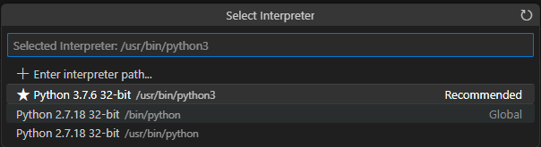

# Live Preview

## Prerequisite

Enable HTTP in WBM.

SSH connection. Please read issuetracker [here](https://github.com/WAGO/vscode-server/issues/5).

## Demo

Download or make a sample webpage to admin-user space. Open this folder.

CTRL+SHIFT+p and 'Live Preview: 'Start server' or pres the icon 'Show Preview' at top right corner.

<figure><figcaption><p><a href="https://onepagelove.com/evelyn">https://onepagelove.com/evelyn</a></p></figcaption></figure>

To start making web pages with the provided lighttpd server we could use this extension for testing the result as we allready have a connection to the device.

```bash
// Quick and dirty
chown admin /var/www
```

Open /var/www folder in VS-Code and create a test page. Then start the live preview server as described above to see the result.
